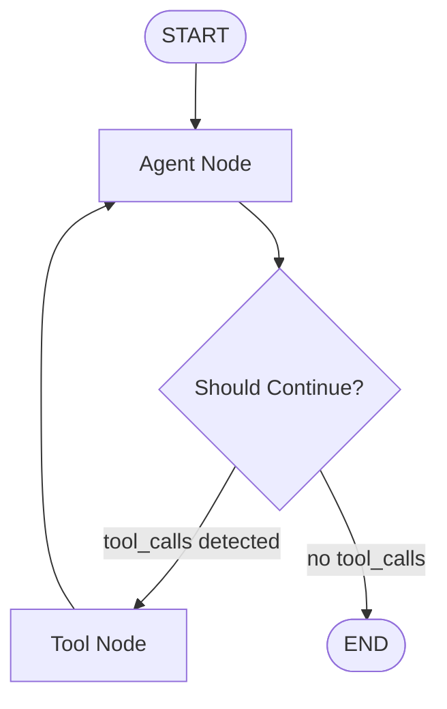

# Agentic AI Personal Assistant using LangGraph

An enterprise-grade, stateful, tool-augmented **AI Personal Assistant** constructed using **LangGraph**, **LangChain**, **OpenRouter**, **Google Gemini**, and **FastAPI**.

Unlike standard linear LLM chains or simplistic prompt-response wrappers, this assistant models AI decision-making as a **Cyclic Directed Graph**. It dynamically reasons over user intent, determines whether to invoke external tools, processes execution output, updates state using immutable reducers, and retains multi-turn thread memory across sessions.

---

## Key Features

- **Cyclic Directed Graph Architecture**: Implements a self-correcting agentic loop where the model reasons, selects and executes tools, inspects execution output, and re-evaluates until a complete response is formed.
- **Multi-Provider Model Cascade**: Enforces high availability by attempting configured providers and models in sequence (for example, OpenRouter free tier models -> Google Gemini -> Local Offline Simulator). If an API call encounters rate limits (HTTP 429), quota limits, or permission errors (HTTP 403), the system seamlessly fails over to the next candidate model.
- **Offline Resilient Fallback Engine**: Integrates an in-process, intent-matching engine (`SimulatedAgentModel`) that ensures full interactive capability during network connectivity issues or total API key outages.
- **Stateful Thread Isolation**: Utilizes `MemorySaver` checkpointer instances to maintain distinct conversation states per `thread_id` session, eliminating cross-session data leakage.
- **Tool-Augmented Execution Capabilities**:
  1. **Calculator**: AST-parsed safe mathematical expression evaluation.
  2. **Weather Lookup**: Structured meteorological data retrieval for global locations.
  3. **Web Search**: DuckDuckGo web search integration for real-time information retrieval.
  4. **Text Summarizer**: Text summarization providing executive bullet points and key takeaways.
- **Dual Interface Deployment**: Production REST API powered by **FastAPI** alongside an interactive command-line interface (CLI).

---

## How the Project Works (Architectural Overview)

### 1. LangGraph State and Reducer Semantics

Central to the architecture is `AssistantState` defined in [`state/assistant_state.py`](file:///d:/Swayam/Projects/Agentic%20AI/AI%20Personal%20Assistant/state/assistant_state.py):

```python
from typing import Annotated, Sequence, TypedDict
from langchain_core.messages import BaseMessage
from langgraph.graph.message import add_messages

class AssistantState(TypedDict):
    messages: Annotated[Sequence[BaseMessage], add_messages]
```

#### Purpose of the `add_messages` Reducer
Standard dictionary updates in Python overwrite existing values. LangGraph utilizes `add_messages` to ensure message histories are modified immutably by appending new messages or updating existing tool responses by message identifier. This maintains state integrity across cyclic execution loops.

---

### 2. Graph Topology and Decision Routing

The execution graph is built as a `StateGraph` in [`graph/builder.py`](file:///d:/Swayam/Projects/Agentic%20AI/AI%20Personal%20Assistant/graph/builder.py):



1. **Agent Node (`agent`)**:
   - Prepends system directives defined in [`prompts/system_prompts.py`](file:///d:/Swayam/Projects/Agentic%20AI/AI%20Personal%20Assistant/prompts/system_prompts.py).
   - Executes the primary model through `invoke_with_model_cascade()`.
2. **Conditional Edge (`should_continue`)**:
   - Evaluates the `AIMessage` produced by the agent.
   - If `tool_calls` are present, routes execution to the `tools` Node.
   - If no `tool_calls` exist, terminates the turn at `__end__`.
3. **Tool Node (`tools`)**:
   - Invokes requested tools with supplied arguments.
   - Appends resulting `ToolMessage` payloads to `AssistantState`.
   - Routes back to the `agent` Node to allow the model to ingest tool results and generate a final response.

---

### 3. Fault-Tolerant Model Cascade Strategy

Model invocation resiliently handles API degradation in [`agents/assistant_agent.py`](file:///d:/Swayam/Projects/Agentic%20AI/AI%20Personal%20Assistant/agents/assistant_agent.py):

```
User Message
   │
   ├─► 1. OpenRouter Models (e.g., nvidia/nemotron-3-super-120b-a12b:free)
   │      │ (Fallback on HTTP 429 / 404 / 403 / Timeout)
   │      ▼
   ├─► 2. Google Gemini Models (e.g., gemini-2.0-flash)
   │      │ (Fallback on Quota Exceeded / Authentication Error)
   │      ▼
   └─► 3. Local SimulatedAgentModel (AST & Regex Intent Parsing)
```

---

## Project Structure

```
AI Personal Assistant/
├── config/
│   ├── __init__.py
│   └── settings.py          # Application configuration via Pydantic BaseSettings
├── state/
│   ├── __init__.py
│   └── assistant_state.py    # LangGraph TypedDict state schema with add_messages
├── prompts/
│   ├── __init__.py
│   └── system_prompts.py    # System prompt templates and behavioral policies
├── tools/
│   ├── __init__.py          # Tool registry exposing ALL_TOOLS
│   ├── calculator.py        # Safe Abstract Syntax Tree math evaluator
│   ├── weather.py           # Meteorological data lookup service
│   ├── search.py            # DuckDuckGo search integration
│   └── summarizer.py        # Content summarization tool
├── agents/
│   ├── __init__.py
│   └── assistant_agent.py   # Multi-provider cascade and SimulatedAgentModel
├── graph/
│   ├── __init__.py
│   └── builder.py           # StateGraph workflow construction and edge routing
├── memory/
│   ├── __init__.py
│   └── checkpointer.py      # MemorySaver checkpointer for thread persistence
├── services/
│   ├── __init__.py
│   └── assistant_service.py # Service layer encapsulating compiled graph operations
├── api/
│   ├── __init__.py
│   ├── schemas.py           # Request and response Pydantic models for REST API
│   └── routes.py            # FastAPI endpoints (/api/chat, /health, /api/state)
├── tests/                   # Automated phased verification suite
│   ├── test_phase1.py       # Configuration and State verification
│   ├── test_phase2.py       # Tool execution unit tests
│   ├── test_phase3.py       # Prompt formatting and model binding tests
│   ├── test_phase4.py       # Graph compilation and topology verification
│   ├── test_phase5.py       # Checkpointer thread isolation tests
│   └── test_phase6.py       # Service layer integration verification
├── .env.example             # Environment variable template
├── main.py                  # FastAPI application entry point
├── test_assistant.py        # Interactive CLI shell
└── requirements.txt         # Package dependencies
```

---

## Installation and Execution

### 1. Prerequisites
- Python 3.10 or higher.

### 2. Environment Setup
Install project dependencies:

```bash
pip install -r requirements.txt
```

Initialize environment variables by copying `.env.example`:

```bash
cp .env.example .env
```

Configure API credentials in `.env`:

```env
# OpenRouter Free Tier Configuration
OPENROUTER_API_KEY=sk-or-v1-your_openrouter_api_key
OPENROUTER_MODELS=nvidia/nemotron-3-super-120b-a12b:free,google/gemma-4-31b-it:free

# Google Gemini Configuration (Optional)
GEMINI_API_KEY=your_gemini_api_key
GEMINI_MODELS=gemini-2.0-flash,gemini-2.0-flash-lite
```

If API keys are omitted or invalid, the system automatically runs using the local offline fallback engine (`SimulatedAgentModel`).

---

### 3. Interactive CLI Shell

To start the terminal interface:

```bash
python test_assistant.py
```

Example Session Output:
```text
============================================================
  LangGraph AI Personal Assistant CLI
============================================================

  Model Cascade (2 models):
    [OpenRouter]
      -> nvidia/nemotron-3-super-120b-a12b:free
      -> google/gemma-4-31b-it:free

  [Thread ID: cli-session-a1b2c3d4]
  Type your message below (or type 'exit' / 'quit' to stop).

You: Hello, my name is Swayam.
Assistant: Hello Swayam. How can I assist you with calculations, weather reports, web searches, or text summarization today?

You: Calculate 45 * 12 + 150
[Tools Executed]:
   - calculate with args {'expression': '45 * 12 + 150'}
Assistant: The output of the calculation is 690.
```

---

### 4. REST API Deployment

To run the web service:

```bash
python main.py
```

Or via Uvicorn:

```bash
uvicorn main:app --host 0.0.0.0 --port 8000 --reload
```

Interactive API documentation is accessible at `http://localhost:8000/docs`.

#### Primary Endpoints:
- `POST /api/chat`: Submit user query and thread context; returns assistant response and executed tools.
- `GET /api/state/{thread_id}`: Retrieve message history for a specific thread session.
- `GET /health`: System health status and active model cascade overview.

---

## Verification and Testing

Execute the multi-phase test suite to validate system integrity:

```bash
python -m tests.test_phase1  # Phase 1: Configuration & State Schemas
python -m tests.test_phase2  # Phase 2: Custom Tools
python -m tests.test_phase3  # Phase 3: System Prompts & Model Binding
python -m tests.test_phase4  # Phase 4: Graph Compilation & Topology
python -m tests.test_phase5  # Phase 5: Memory Checkpointer Isolation
python -m tests.test_phase6  # Phase 6: Service Layer Integration
```

---

## Key Takeaways and Architectural Learnings

Developing this system yielded several technical insights regarding agentic architecture:

1. **Stateful Directed Graphs over Linear Chains**: Linear pipelines are inherently deterministic and fail under unpredictable intermediate states. Cyclic directed graphs grant the agent autonomous control to loop, retry, select tools dynamically, and self-correct.
2. **Reducer-Driven State Management**: Using immutable reducers such as `add_messages` eliminates bugs related to state mutation, ensuring that state transitions remain predictable during multi-turn loops.
3. **Abstract Syntax Tree (AST) Security**: Executing user-provided mathematical expressions via raw `eval()` creates severe arbitrary code execution vulnerabilities. Parsing expressions into AST nodes (`ast.parse`) ensures strict containment of executable operations.
4. **Multi-Tiered Fault Tolerance**: Production deployment of LLM systems must account for rate limits, model deprecation, and unexpected outages. Layering model cascades across distinct providers with an offline fallback guarantees unbroken operational availability.
5. **Session Isolation via Checkpointers**: Managing conversational state across concurrent users requires isolated state persistence. LangGraph checkpointers indexed by `thread_id` prevent context bleed and maintain privacy across sessions.

---

## License

This project is licensed under the MIT License. See `LICENSE` for details.
